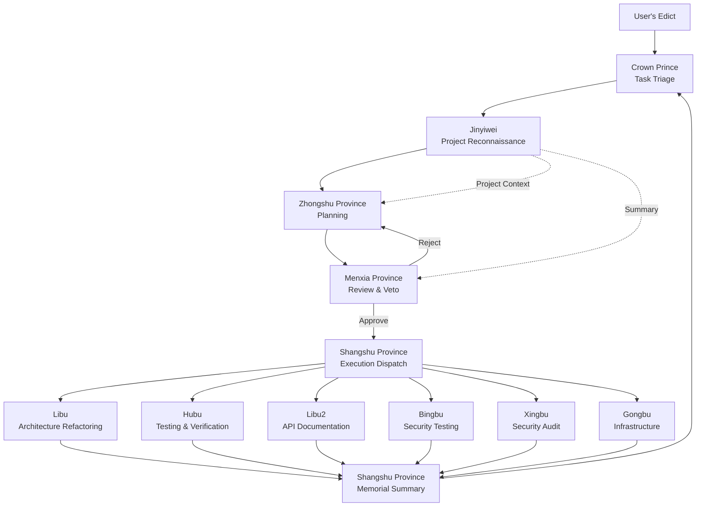

# Emperor — Three Departments and Six Ministries Multi-Agent Collaboration System

An [OpenCode](https://opencode.ai) plugin that maps the governance wisdom of ancient China's Three Departments and Six Ministries system into a multi-agent collaboration architecture for orchestrating complex programming tasks.

## Architecture Overview



**Full Flow**: User's Edict → Crown Prince Triage → Jinyiwei Reconnaissance → Zhongshu Planning → Menxia Review → Shangshu Dispatch → Six Ministries Parallel Execution → Shangshu Summary → Crown Prince Acceptance

**Core Rule**: The Crown Prince only communicates with the Three Provinces (Zhongshu, Menxia, Shangshu), never directly assigning tasks to the Six Ministries.

## Eleven Agents

| Agent | Role | Responsibility |
|-------|------|----------------|
| **Crown Prince** (taizi) | Triage | Receives user requests, analyzes task nature, only communicates with Three Provinces |
| **Jinyiwei** (jinyiwei) | Reconnaissance | Scans project code, generates architecture maps and context reports for planning intelligence |
| **Zhongshu Province** (zhongshu) | Planner | Breaks down tasks into subtasks, assigns to appropriate Six Ministries, outputs structured JSON plans |
| **Menxia Province** (menxia) | Reviewer | Reviews plan rationality, risks, and dependencies; can veto and send back |
| **Shangshu Province** (shangshu) | Execution Dispatch | Receives approved plans, dispatches Six Ministries for parallel execution, monitors progress, summarizes memorials |
| **Libu** (libu) | Architect | Code architecture, refactoring, type system, module design |
| **Hubu** (hubu) | Tester | Testing and verification, ensuring code works (mandatory participation) |
| **Libu2** (libu2) | API Officer | API design, protocol integration, documentation |
| **Bingbu** (bingbu) | Security Officer | Security testing, performance optimization, error handling |
| **Xingbu** (xingbu) | Auditor | Security audit, compliance checks, vulnerability scanning (read-only, no code modification) |
| **Gongbu** (gongbu) | Engineer | Build tools, CI/CD, deployment, environment configuration |

## Custom Tools

### Create Edict (`emperor_create_edict`)

Creates an edict and starts the complete workflow.

```
Input Parameters:
  - title: Edict title
  - content: Specific requirement description
  - priority: Priority (low / medium / high / critical)
```

### View Memorial (`emperor_view_memorial`)

Queries historical edicts and execution results.

```
Input Parameters:
  - edict_id: (Optional) View specific edict's memorial
  - status: (Optional) Filter by status (planning / reviewing / executing / completed / failed / halted)
```

### Halt Edict (`emperor_halt_edict`)

Emergency halt of executing edict.

```
Input Parameters:
  - edict_id: Edict ID to halt
  - reason: Reason for halt
```

## Installation & Configuration

### 1. Plugin Registration

Add plugin path in `.opencode/opencode.json`:

```json
{
  "$schema": "https://opencode.ai/config.json",
  "plugin": [
    "./plugins/emperor/index.ts"
  ]
}
```

### 2. Emperor Configuration

The plugin uses a separate `.opencode/emperor.json` configuration file (not mixed with `opencode.json`):

```json
{
  "agents": {
    "taizi": { "model": "anthropic/claude-sonnet-4-20250514" },
    "jinyiwei": { "model": "anthropic/claude-sonnet-4-20250514" },
    "zhongshu": { "model": "anthropic/claude-sonnet-4-20250514" },
    "menxia": { "model": "anthropic/claude-sonnet-4-20250514" },
    "shangshu": { "model": "anthropic/claude-sonnet-4-20250514" },
    "libu": { "model": "anthropic/claude-sonnet-4-20250514" },
    "hubu": { "model": "anthropic/claude-sonnet-4-20250514" },
    "libu2": { "model": "anthropic/claude-sonnet-4-20250514" },
    "bingbu": { "model": "anthropic/claude-sonnet-4-20250514" },
    "xingbu": { "model": "anthropic/claude-sonnet-4-20250514" },
    "gongbu": { "model": "anthropic/claude-sonnet-4-20250514" }
  },
  "pipeline": {
    "maxPlanningRetries": 3,
    "reviewMode": "mixed",
    "sensitivePatterns": ["删除", "drop", "rm -rf", "production", "密钥", "credentials"],
    "mandatoryDepartments": ["hubu"],
    "requirePostVerification": true,
    "maxSubtaskRetries": 1
  },
  "recon": {
    "enabled": true,
    "cacheDir": "recon"
  },
  "store": {
    "dataDir": ".opencode/emperor-data"
  }
}
```

#### Configuration Options

- **agents**: Model configuration for each Agent, can specify different models as needed
- **pipeline.maxPlanningRetries**: Maximum retry attempts when Zhongshu plan is rejected by Menxia
- **pipeline.reviewMode**: Review mode
  - `auto` — Auto review, sensitive operations still require manual confirmation
  - `manual` — All operations require manual confirmation
  - `mixed` — Default auto, switches to manual when sensitive operations detected (recommended)
- **pipeline.sensitivePatterns**: Keywords that trigger manual review
- **pipeline.mandatoryDepartments**: Departments that must participate (default `["hubu"]`), Menxia will automatically reject plans missing these departments
- **pipeline.requirePostVerification**: Whether to perform Hubu post-verification after Six Ministries execution (default `true`)
- **store.dataDir**: Edict data persistence directory
- **recon.enabled**: Whether to enable Jinyiwei reconnaissance (default `true`). When disabled, skips Phase 0, doesn't inject project context
- **recon.cacheDir**: Reconnaissance report cache directory (relative to store.dataDir), cached by git hash, no repeated scans for same commit
- **pipeline.maxSubtaskRetries**: Auto retry count after subtask failure (default `1`). Retries reuse same session and inform agent of previous failure reason

## Usage

### Method 1: Via Crown Prince Agent

In OpenCode, switch to `taizi` Agent and describe your requirement:

```
@taizi I need to add a user authentication system to the project, including JWT tokens, refresh mechanism, and role-based access control
```

The Crown Prince will automatically triage and trigger the complete Three Provinces Six Ministries workflow.

### Method 2: Via Edict Tool

Any Agent can call the edict tool:

```
Use emperor_create_edict tool:
  title: "User Authentication System"
  content: "Implement JWT authentication, token refresh, RBAC permission control"
  priority: "high"
```

### View Execution Results

```
Use emperor_view_memorial tool:
  edict_id: "edict_1709712000000_a1b2"
```

## Workflow Mechanism

### Sensitive Operation Detection

Menxia Province automatically scans subtask descriptions, matching sensitive keywords (like "delete", "production", "credentials", etc.). When matched:

1. Mark as sensitive operation
2. Pop up confirmation dialog, requires manual approval
3. User can approve or reject

### Jinyiwei Reconnaissance (Phase 0)

Before each edict execution, Jinyiwei scans the project code first, generating a structured report with mermaid charts:

1. **Tech Stack Identification**: Language, framework, build tool, package manager
2. **Directory Structure Analysis**: Module division, entry files, configuration locations
3. **Architecture Pattern Recognition**: Design patterns, layered architecture, data flow
4. **Dependency Graph**: Mermaid module dependency graph
5. **Feature Map**: Detailed analysis of feature modules related to the edict

**Tiered Injection** (control token costs):
- Full report → Zhongshu Province (planning needs full picture)
- Summary report → Menxia Province (review only needs key info)
- No injection → Shangshu Province, Six Ministries (avoid token waste)

**Smart Caching**: Results cached by git hash, no repeated scans for same commit, significantly reducing costs.

### Mandatory Department Participation

Through `mandatoryDepartments` configuration, specific departments can be required to participate in every task execution. By default, Hubu (testing verification) is required to participate, ensuring all plans are tested. This check is enforced at both the Menxia review stage and code level; plans missing required departments are automatically rejected.

### Dependency Dispatch

Six Ministries subtasks support dependency declaration. The dispatch engine uses topological sorting (Kahn's algorithm) to group subtasks into execution waves:

- **Wave 1**: Independent subtasks execute in parallel
- **Wave 2**: Subtasks depending on Wave 1 results execute in parallel
- **And so on...**

### Shangshu Province Dispatch

As the execution dispatch, Shangshu Province takes over the workflow after Menxia Province approval:

1. **Pre-dispatch**: Review execution strategy, confirm resource allocation
2. **Code dispatch**: Topological sort based parallel dispatch of Six Ministries, real-time Toast progress notifications for each Wave
3. **Automatic retry on failure**: Subtask failures automatically retry (reuse same session, inform of failure reason)
4. **Failure analysis**: On continued failure after retry, Shangshu analyzes failure reason (code issue/test issue/environment issue) and provides fix suggestions
5. **Post-verification**: Optional Hubu post-verification stage
6. **Memorial summary**: AI generates structured memorial with retry statistics and failure analysis

### Memorial Format

After execution completes, Shangshu Province generates a structured Memorial containing:

- Each ministry's execution results and status (including retry counts)
- Success/failure statistics
- Risk warnings and Menxia Province review comments

## Project Structure

```
.opencode/
├── emperor.json                         # Plugin configuration
├── opencode.json                        # OpenCode configuration (plugin registration)
└── plugins/emperor/
    ├── index.ts                         # Plugin entry
    ├── types.ts                         # Type definitions
    ├── config.ts                        # Configuration loader
    ├── store.ts                         # Edict data persistence
    ├── agents/
    │   └── prompts.ts                   # Eleven Agents system prompts
    ├── skills/                          # Plugin built-in Skills
    │   ├── taizi-reloaded/              # Crown Prince enhanced (judgment-execution separation)
    │   ├── quick-verify/                # Quick verification skill
    │   ├── hubu-tester/                 # Hubu Tester
    │   └── menxia-reviewer/             # Menxia Reviewer
    ├── engine/
    │   ├── pipeline.ts                  # Workflow engine main flow (includes Jinyiwei Recon + Shangshu Dispatch)
    │   ├── recon.ts                     # Jinyiwei reconnaissance engine (git-hash cache + tiered injection)
    │   ├── reviewer.ts                  # Menxia review + mandatory department check + sensitive operation detection
    │   └── dispatcher.ts               # Six Ministries dispatch (topological sort + parallel execution)
    └── tools/
        ├── edict.ts                     # Create edict tool
        ├── memorial.ts                  # View memorial tool
        └── halt.ts                      # Halt tool
```

## Built-in Skills

The plugin comes with the following enhanced Skills, automatically enabled after plugin installation:

| Skill | Description |
|-------|--------------|
| `taizi-reloaded` | Crown Prince enhanced, emphasizes judgment-execution separation and verification first |
| `quick-verify` | Quick verification skill, forces pre-delivery verification |
| `hubu-tester` | Hubu Tester, complete verification report template |
| `menxia-reviewer` | Menxia Reviewer, adds code security review |

### Usage

```
@skill taizi-reloaded
@skill quick-verify
@skill hubu-tester
@skill menxia-reviewer
```

## Tech Stack

- **Runtime**: Bun
- **Language**: TypeScript (strict mode)
- **Plugin SDK**: @opencode-ai/plugin
- **Data Persistence**: JSON file storage

---

[中文版](./README.zh-CN.md) | [English](./README.md)
