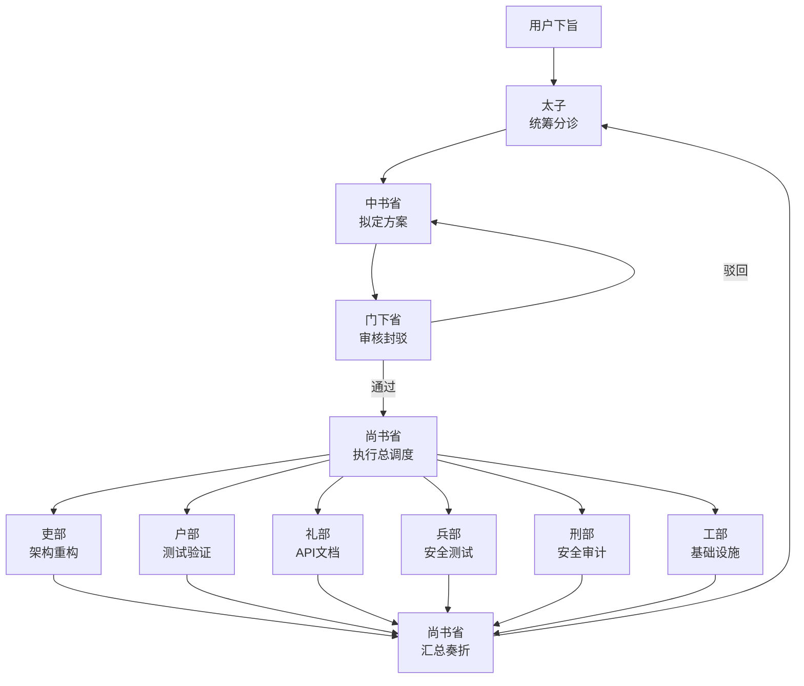

# Emperor — 三省六部多智能体协作系统

> 将中国古代三省六部制的治理智慧映射为多智能体协作架构

## 概述

Emperor 是一个 [OpenCode](https://opencode.ai) 插件，将中国古代三省六部制的治理智慧映射为多智能体协作架构，用于编排复杂的编程任务。通过模拟古代中央政权的决策与执行流程，实现复杂任务的有序分解、审核与执行。

## 架构概览



**完整流程**：用户下旨 → 太子分诊 → 中书省规划 → 门下省审核 → 尚书省调度 → 六部并行执行 → 尚书省汇总奏折 → 太子验收

**核心规则**：太子只与三省（中书省、门下省、尚书省）沟通，绝不直接找六部派活。

---

## 十部 Agent

| Agent | 角色 | 职责 |
|-------|------|------|
| **太子** (taizi) | 分诊官 | 接收用户请求，分析任务性质，只与三省沟通 |
| **中书省** (zhongshu) | 规划师 | 将任务拆解为子任务，分配给对应六部，输出结构化 JSON 方案 |
| **门下省** (menxia) | 审查官 | 审核中书省方案的合理性、风险和依赖关系，可封驳退回 |
| **尚书省** (shangshu) | 执行总调度 | 接收审核通过的方案，调度六部并行执行，监控进度，汇总奏折 |
| **吏部** (libu) | 架构师 | 负责代码架构、重构、类型系统、模块设计 |
| **户部** (hubu) | 测试官 | 负责测试与验证，确保代码能正常工作（强制参与） |
| **礼部** (lifebu) | 接口官 | 负责 API 设计、协议对接、文档编写 |
| **兵部** (bingbu) | 安全官 | 负责安全测试、性能优化、错误处理 |
| **刑部** (xingbu) | 审计官 | 负责安全审计、合规检查、漏洞扫描（只读，不修改代码） |
| **工部** (gongbu) | 工程师 | 负责构建工具、CI/CD、部署、环境配置 |

---

## 核心功能

### 1. 敏感操作检测

门下省会自动扫描子任务描述，匹配敏感关键词（如"删除"、"production"、"密钥"等）。匹配到时：

1. 标记为敏感操作
2. 弹出确认对话框，需用户手动批准
3. 用户可选择批准或驳回

### 2. 强制部门参与

通过 `mandatoryDepartments` 配置，可强制要求特定部门参与每次任务执行。默认要求户部（测试验证）参与，确保所有方案都经过测试。

该检查在门下省审核阶段和代码层面同时执行，缺少必要部门的方案将被自动驳回。

### 3. 依赖调度

六部子任务支持依赖声明。调度引擎使用拓扑排序（Kahn 算法）将子任务分组为执行波次：

- **Wave 1**: 无依赖的子任务并行执行
- **Wave 2**: 依赖 Wave 1 结果的子任务并行执行
- **依此类推...**

### 4. 尚书省调度

尚书省作为执行总调度，在门下省审核通过后接管流程：

1. **预调度**：审查执行策略，确认资源分配
2. **代码调度**：基于拓扑排序并行调度六部执行
3. **后置验证**：可选的户部后置验证环节
4. **汇总奏折**：AI 生成结构化奏折，汇报各部执行结果

### 5. 数据持久化

圣旨和奏折存储在 JSON 文件中，可通过 `memorial` 工具查询历史记录。

---

## 自定义工具

### 下旨 (`emperor_edict`)

创建圣旨并启动完整流转流程。

```
输入参数:
  - title: 圣旨标题
  - content: 旨意完整内容
  - priority: 优先级 (urgent / normal / low)
```

### 查看奏折 (`emperor_memorial`)

查询历史圣旨和执行结果。

```
输入参数:
  - id: (可选) 查看特定圣旨的奏折
```

### 叫停 (`emperor_halt`)

紧急叫停正在执行的圣旨。

```
输入参数:
  - id: 要叫停的圣旨 ID
  - reason: (可选) 叫停原因
```

---

## 安装配置

### 1. 插件注册

在 `.opencode/opencode.json` 中添加插件路径：

```json
{
  "$schema": "https://opencode.ai/config.json",
  "plugin": [
    "./plugins/emperor/index.ts"
  ]
}
```

### 2. Emperor 配置

插件使用独立的 `.opencode/emperor.json` 配置文件：

```json
{
  "agents": {
    "taizi": { "model": "anthropic/claude-sonnet-4-20250514" },
    "zhongshu": { "model": "anthropic/claude-sonnet-4-20250514" },
    "menxia": { "model": "anthropic/claude-sonnet-4-20250514" },
    "shangshu": { "model": "anthropic/claude-sonnet-4-20250514" },
    "libu": { "model": "anthropic/claude-sonnet-4-20250514" },
    "hubu": { "model": "anthropic/claude-sonnet-4-20250514" },
    "libu2": { "model": "anthropic/claude-sonnet-4-20250514" },
    "bingbu": { "model": "anthropic/claude-sonnet-4-20250514" },
    "xingbu": { "model": "anthropic/claude-sonnet-4-20250514" },
    "gongbu": { "model": "anthropic/claude-sonnet-4-20250514" }
  },
  "pipeline": {
    "maxReviewAttempts": 3,
    "sensitivePatterns": [
      "删除|remove|delete|drop",
      "数据库.*迁移|migration",
      "密钥|secret|credential|password",
      "生产环境|production|deploy",
      "权限|permission|auth.*config"
    ],
    "mandatoryDepartments": ["hubu"],
    "requirePostVerification": true
  },
  "store": {
    "dataDir": ".opencode/plugins/emperor/data"
  }
}
```

#### 配置项说明

| 配置项 | 类型 | 默认值 | 说明 |
|--------|------|--------|------|
| `agents` | Record | - | 每个 Agent 的模型配置 |
| `pipeline.maxReviewAttempts` | number | 3 | 中书省规划被驳回后的最大重试次数 |
| `pipeline.sensitivePatterns` | string[] | 见上文 | 触发人工审核的敏感关键词 |
| `pipeline.mandatoryDepartments` | string[] | ["hubu"] | 强制参与的部门 |
| `pipeline.requirePostVerification` | boolean | true | 是否执行后置验证 |
| `store.dataDir` | string | - | 圣旨数据持久化目录 |

---

## 使用方式

### 方式一：通过太子 Agent

在 OpenCode 中切换到 `taizi` Agent，直接描述你的需求：

```
@taizi 我需要给项目添加用户认证系统，包括 JWT token、刷新机制、以及角色权限控制
```

太子会自动分诊并触发完整的三省六部流转。

> **提示**：太子只与三省（中书省、门下省、尚书省）沟通，绝不直接找六部派活。六部由尚书省统一调度。

### 方式二：通过下旨工具

任何 Agent 都可以调用下旨工具：

```
使用 emperor_edict 工具:
  title: "用户认证系统"
  content: "实现 JWT 认证、token 刷新、RBAC 权限控制"
  priority: "high"
```

### 查看执行结果

```
使用 emperor_memorial 工具:
  id: "edict_1709712000000_a1b2"
```

---

## 项目结构

```
.opencode/
├── emperor.json                    # 插件配置
├── opencode.json                   # OpenCode 配置（注册插件）
└── plugins/emperor/
    ├── index.ts                    # 插件入口
    ├── types.ts                    # 类型定义
    ├── config.ts                   # 配置加载器
    ├── store.ts                    # 圣旨数据持久化
    ├── agents/
    │   └── prompts.ts              # 十部 Agent 系统提示词
    ├── skills/                     # 插件内置 Skills
    │   ├── taizi-reloaded/         # 太子增强版
    │   ├── quick-verify/           # 快速验证技能
    │   ├── hubu-tester/            # 户部测试官
    │   └── menxia-reviewer/        # 门下省审核官
    ├── engine/
    │   ├── pipeline.ts             # 流转引擎主流程
    │   ├── reviewer.ts             # 门下省审核
    │   └── dispatcher.ts           # 六部调度（拓扑排序）
    └── tools/
        ├── edict.ts                # 下旨工具
        ├── memorial.ts             # 查看奏折工具
        └── halt.ts                 # 叫停工具
```

---

## 内置 Skills

插件自带以下增强版 Skills，安装插件后自动启用：

| Skill | 说明 |
|-------|------|
| `taizi-reloaded` | 太子增强版，强调判断-执行分离和验证优先 |
| `quick-verify` | 快速验证技能，强制交付前验证 |
| `hubu-tester` | 户部测试官，完善的验证报告模板 |
| `menxia-reviewer` | 门下省审核官，增加代码安全审查 |

### 使用 Skill

```
@skill taizi-reloaded
@skill quick-verify
@skill hubu-tester
@skill menxia-reviewer
```

---

## 技术栈

- **运行时**: Bun
- **语言**: TypeScript (strict mode)
- **插件 SDK**: @opencode-ai/plugin
- **数据持久化**: JSON 文件存储

---

## 类型定义

### EdictStatus — 状态机

```typescript
type EdictStatus =
  | "received"        // 太子分拣完毕，进入流程
  | "planning"        // 中书省规划中
  | "reviewing"       // 门下省审核中
  | "needs_approval"  // 敏感操作，等待用户确认
  | "denied"          // 用户拒绝
  | "rejected"        // 门下省封驳
  | "dispatched"      // 尚书省已派发
  | "executing"       // 六部执行中
  | "completed"       // 全部完成
  | "failed"          // 执行失败
  | "halted"          // 用户叫停
```

#### 状态流转图

```
received → planning → reviewing ─┬─→ needs_approval → denied
                    │             │
                    │             ├─→ rejected → planning (retry)
                    │             │
                    │             └─→ approved → dispatched → executing → completed
                    │                                     │
                    └─────────────────────────────────────┘ (failed/halted)
```

### DepartmentId — 部门 ID

```typescript
type DepartmentId = "bingbu" | "gongbu" | "lifebu" | "xingbu" | "hubu" | "libu"
```

### Plan — 规划方案

```typescript
interface Plan {
  analysis: string      // 用户场景分析 + 技术选型理由
  subtasks: Subtask[]   // 子任务列表
  risks: string[]       // 风险识别
  attempt: number       // 当前尝试次数
}
```

### Subtask — 子任务

```typescript
interface Subtask {
  index: number                    // 任务索引
  department: DepartmentId         // 负责部门
  title: string                    // 任务标题
  description: string              // 任务描述
  dependencies: number[]           // 依赖的其他任务索引
  effort: "low" | "medium" | "high" // 工作量评估
}
```

### Review — 审核结果

```typescript
interface Review {
  verdict: "approve" | "reject"    // 审核结论
  reasons: string[]                // 驳回理由
  suggestions: string[]            // 改进建议
  sensitiveOps: string[]           // 敏感操作列表
}
```

---

## 参与贡献

欢迎提交 Issue 和 Pull Request！

- **GitHub**: https://github.com/sjzsdu/emperor
- **作者**: sunjuzhong

---

## 许可证

MIT License
