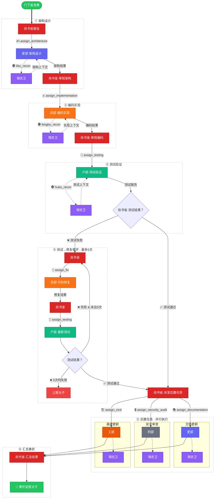

# 三省流转关系

> 太子、锦衣卫与三省（中书省、门下省、尚书省）之间的协作流转机制

---

## 总览

```
皇帝(用户)
  │
  ▼
太子 ──→ 锦衣卫(侦察) ──→ 太子 ──→ 皇帝(澄清) ──→ 太子
  │                                                    │
  │  ┌─────────────────────────────────────────────────┘
  ▼  ▼
中书省(拟方案) ←── 锦衣卫上下文(完整报告)
  │
  ▼
门下省(审方案) ←── 锦衣卫上下文(摘要)
  │
  ├─ 驳回 → 回中书省重新拟方案(最多3次)
  │
  └─ 通过 → 尚书省(执行)
                │
                ▼
            六部并行执行
                │
                ▼
            尚书省汇总奏折 → 太子验收
```

---

## 角色定义

| 角色 | 隐喻 | 核心职责 | 一句话定位 |
|------|------|---------|-----------|
| **皇帝** | 用户 | 提出需求、澄清疑问、最终决策 | 需求的源头和最终裁决者 |
| **太子** | 统筹分诊官 | 接收需求、调度三省、不直接干活 | 流程的发起者和协调者 |
| **锦衣卫** | 项目侦察官 | 扫描项目代码、生成上下文报告 | 情报提供者，贯穿全流程 |
| **中书省** | 规划师 | 拆解任务、分配部门、输出方案 | 方案的制定者 |
| **门下省** | 审查官 | 审核方案、封驳退回、质量把关 | 方案的审核者 |
| **尚书省** | 执行总调度 | 调度六部、监控进度、汇总奏折 | 方案的执行者 |

---

## 三阶段流转详解

### Phase 0 — 需求侦察与澄清（太子 + 锦衣卫 + 皇帝）

```
皇帝 ──(下旨)──→ 太子 ──(命令侦察)──→ 锦衣卫
                                          │
                                    扫描项目代码
                                    生成结构化报告
                                          │
                   太子 ←──(侦察报告)──────┘
                     │
               初步整理需求
            识别不明朗事项
                     │
                     ▼
              ┌──────────────┐
              │ 有不明朗事项？ │
              └──────┬───────┘
                     │
              是     │     否
              ▼      │      ▼
         向皇帝澄清  │   直接进入 Phase 1
              │      │
              ▼      │
         皇帝回复    │
              │      │
              ▼      │
         需求明确 ───┘
```

**太子的职责**：
1. 接收皇帝（用户）的原始需求
2. 命令锦衣卫扫描项目，获取技术栈、目录结构、架构模式等基础信息
3. 结合锦衣卫报告，初步整理需求，判断是否有模糊或矛盾之处
4. 如有不明朗事项，**主动向皇帝（用户）确认**，而不是让中书省猜测
5. 需求明确后，才将整理后的需求连同锦衣卫报告一起转交中书省

**关键原则**：太子是三省的"甲方"，负责确保需求清晰完整后再下发。模糊的需求不应流入中书省。

---

### Phase 1 — 方案拟定（中书省 + 锦衣卫上下文）

```
太子 ──(整理后的需求 + 锦衣卫完整报告)──→ 中书省
                                             │
                                       分析项目上下文
                                       拆解为子任务
                                       分配负责部门
                                       评估风险和依赖
                                             │
                                             ▼
                                     输出结构化 Plan JSON
                                             │
                       太子 ←───(方案)────────┘
                         │
                         ▼
                    转交门下省审核
```

**中书省的输入**：
- 太子整理后的明确需求（经皇帝澄清）
- 锦衣卫的**完整侦察报告**（包含技术栈、目录结构、架构模式、模块依赖图、功能地图）

**中书省的输出**：
```json
{
  "analysis": "场景分析 + 技术选型理由",
  "subtasks": [
    {
      "index": 0,
      "department": "bingbu",
      "title": "实现 JWT 认证中间件",
      "description": "...",
      "dependencies": [],
      "effort": "medium"
    }
  ],
  "risks": ["需注意现有 session 机制的兼容性"],
  "attempt": 1
}
```

**关键原则**：中书省只负责"怎么做"，不质疑"做什么"。需求的合理性由太子在 Phase 0 把关。

---

### Phase 2 — 方案审核（门下省 + 锦衣卫上下文）

```
太子 ──(中书省方案 + 锦衣卫摘要)──→ 门下省
                                        │
                                  审核方案合理性
                                  检查四大维度：
                                  ① 完备性
                                  ② 可行性
                                  ③ 风险评估
                                  ④ 效率评估
                                        │
                                  代码层敏感操作检测
                                  强制部门参与检查
                                        │
                                        ▼
                                ┌────────────────┐
                                │  审核结论       │
                                ├────────┬───────┤
                                │ 准奏   │ 封驳   │
                                └───┬────┴───┬───┘
                                    │        │
                                    ▼        ▼
                              转交尚书省  退回中书省
                                         重新拟方案
                                        (最多3次)
```

**门下省的输入**：
- 中书省输出的结构化方案
- 锦衣卫的**摘要报告**（非完整报告，控制 token 成本）

**门下省的审核维度**：

| 维度 | 审查内容 | 不通过条件 |
|------|---------|-----------|
| **完备性** | 是否覆盖旨意全部需求 | 遗漏关键需求点 |
| **可行性** | 子任务描述是否清晰，部门分配是否合理 | 描述模糊或部门分配错误 |
| **风险** | 是否遗漏安全、兼容性、性能风险 | 存在未识别的重大风险 |
| **效率** | 任务拆解粒度是否适当 | 拆解过粗或过细 |

**门下省额外的代码层检查**（不依赖 LLM）：
- **敏感操作检测**：正则匹配 `删除`、`drop`、`production`、`密钥` 等关键词 → 触发人工审批
- **强制部门检查**：方案中必须包含 `mandatoryDepartments` 配置的部门（默认 `hubu`），否则自动封驳

**门下省的输出**：
```json
{
  "verdict": "approve" | "reject",
  "reasons": ["户部（测试验证）未包含在方案中"],
  "suggestions": ["建议增加户部子任务以确保测试覆盖"],
  "sensitiveOps": ["子任务 3 涉及删除操作"]
}
```

**关键原则**：门下省只审核方案，不修改方案。如果不通过，说明理由退回中书省重做，而不是自己改。

---

### Phase 3 — 尚书省六部执行流程（详细）

门下省准奏后，尚书省接管方案，通过**派发工具**逐步调度六部执行。每一道转呈都是一个独立工具调用。



---

```
门下省 --(准奏)--→ 尚书省
                      │
              ┌───────┴────────┐
              │  阶段一：架构设计 │
              └───────┬────────┘
                      │
    [assign_architecture] → 吏部(+libu_recon)
                      │
                 架构设计结果
                      │
              ┌───────┴────────┐
              │  阶段二：编码实现 │
              └───────┬────────┘
                      │
    [assign_implementation] → 兵部(+bingbu_recon+read/grep/glob)
                      │
                 编码实现结果
                      │
              ┌───────┴────────┐
              │  阶段三：测试验证 │
              └───────┬────────┘
                      │
    [assign_testing] → 户部(+hubu_recon+bash)
                      │
               ┌──────┴──────┐
               │             │
          测试通过       测试失败
               │             │
               │    ┌────────┴────────┐
               │    │  阶段四：修复循环  │
               │    │  (最多5次)       │
               │    │                  │
               │    │ [assign_fix]     │
               │    │  → 兵部修复代码  │
               │    │      ↓           │
               │    │ [assign_testing] │
               │    │  → 户部重新测试  │
               │    │      ↓           │
               │    │ 通过? → 退出循环 │
               │    │ 失败? → 继续循环 │
               │    └─────────────────┘
               │
          ┌────┴─────────┐
          │ 阶段五：后置任务 │
          │ (三项并行)    │
          └────┬─────────┘
               │
    ┌──────────┼──────────┐
    │          │          │
    ▼          ▼          ▼
[assign_doc] [assign_sec] [assign_cicd]
 → 吏部       → 刑部      → 工部
    │          │          │
    └──────────┼──────────┘
               │
          ┌────┴─────────┐
          │ 阶段六：汇总奏折 │
          └────┬─────────┘
               │
               ▼
          太子验收
```

**尚书省的7个派发工具**：

| 工具 | 方向 | 用途 | 阶段 |
|------|------|------|------|
| `assign_architecture` | 尚书省→吏部 | 架构设计/模块规划 | 阶段一 |
| `assign_implementation` | 尚书省→兵部 | 编码实现 | 阶段二 |
| `assign_testing` | 尚书省→户部 | 测试验证 | 阶段三 |
| `assign_fix` | 尚书省→兵部 | 代码修复（测试失败时） | 阶段四（循环） |
| `assign_documentation` | 尚书省→吏部 | 文档更新 | 阶段五（并行） |
| `assign_security_audit` | 尚书省→刑部 | 安全合规审查 | 阶段五（并行） |
| `assign_cicd` | 尚书省→工部 | CI/CD更新 | 阶段五（并行） |

**各部门的锦衣卫侦察工具**：

| 工具 | 调用方 | 侦察视角 |
|------|--------|----------|
| `libu_recon` | 吏部 | 架构/模块/类型系统/文档 |
| `bingbu_recon` | 兵部 | 代码风格/接口/测试模式/可复用组件 |
| `hubu_recon` | 户部 | 测试框架/测试命令/构建配置 |
| `xingbu_recon` | 刑部 | 安全配置/敏感数据/依赖安全 |
| `gongbu_recon` | 工部 | 构建工具/CI流水线/部署配置 |

**执行流程的关键规则**：

1. **严格顺序**：架构→编码→测试→（修复循环）→后置任务→奏折
2. **测试修复循环上限5次**：超过后尚书省上报太子
3. **后置任务可并行**：文档、安全审查、CI/CD三项互不依赖
4. **各部门主动侦察**：每个部门执行前先调用对应的 `xxx_recon` 工具获取项目上下文
5. **执行上下文传递**：尚书省通过 `ExecutionContext` 跟踪各阶段结果，供后续部门参考
---

## 三省之间的核心关系

### 1. 单向流水线，非双向沟通

```
中书省 ──→ 门下省 ──→ 尚书省
  ↑            │
  └─(封驳退回)─┘
```

三省之间是**严格的单向流转**，不存在"门下省跟中书省商量着改"这种情况。门下省要么通过，要么打回重做。

### 2. 各省独立决策，职责分明

| | 中书省 | 门下省 | 尚书省 |
|---|---|---|---|
| **决策权** | 怎么拆、谁来做 | 方案是否合理 | 怎么调度执行 |
| **输入** | 需求 + 完整上下文 | 方案 + 摘要上下文 | 审核通过的方案 |
| **输出** | 结构化方案 JSON | 审核结论 JSON | 执行结果 + 奏折 |
| **可读写** | 只读（分析代码） | 只读（审核方案） | 读写（调度执行） |
| **与锦衣卫关系** | 获取完整侦察报告 | 获取摘要报告 | 不获取报告 |

### 3. 锦衣卫的分层注入策略

锦衣卫不属于三省，但为三省和六部提供情报支持。注入策略按需控制：

```
锦衣卫侦察报告
    │
    ├── 完整报告 (zhongshu_recon) ──→ 中书省（规划需要全貌了解）
    │
    ├── 摘要报告 (menxia_recon) ──→ 门下省（审核只需关键信息）
    │
    ├── 架构视角 (libu_recon)   ──→ 吏部（架构/模块/类型系统）
    │
    ├── 实现视角 (bingbu_recon)  ──→ 兵部（代码风格/接口/模式）
    │
    ├── 测试视角 (hubu_recon)   ──→ 户部（测试框架/命令/配置）
    │
    ├── 安全视角 (xingbu_recon)  ──→ 刑部（安全配置/敏感数据）
    │
    └── 基建视角 (gongbu_recon)  ──→ 工部（CI/CD/构建/部署）
```

每个部门的侦察工具会根据该部门的职责，向锦衣卫提出有针对性的侦察要求，获取该部门最关心的信息。

### 4. 太子的角色边界

太子是流程的**发起者和协调者**，但不是流程的**参与者**：

- ✅ 太子命令锦衣卫侦察
- ✅ 太子向皇帝澄清需求
- ✅ 太子将需求转交中书省
- ✅ 太子将方案转交门下省
- ✅ 太子验收最终奏折
- ❌ 太子不参与方案制定
- ❌ 太子不参与方案审核
- ❌ 太子不直接指挥六部

---

## 封驳机制（门下省 → 中书省）

封驳是门下省的核心权力，也是三省制衡的关键：

```
                    ┌────────────────────────────┐
                    │        封驳循环              │
                    │                            │
                    │  第 1 次: 中书省方案        │
                    │     ↓                      │
                    │  门下省审核 → 封驳          │
                    │     ↓ (附驳回理由)          │
                    │  第 2 次: 中书省修订方案    │
                    │     ↓                      │
                    │  门下省审核 → 封驳          │
                    │     ↓ (附驳回理由)          │
                    │  第 3 次: 中书省再修订      │
                    │     ↓                      │
                    │  门下省审核 → 准奏/终止     │
                    │                            │
                    └────────────────────────────┘
```

- 中书省每次修订时会收到门下省的**驳回理由和改进建议**
- 最多循环 3 次（`maxPlanningRetries` 配置）
- 3 次封驳后仍不通过，流程终止，向皇帝（用户）报告原因

---

## 完整流转时序

```
时间轴 →

皇帝    ──下旨──→          ←─澄清─→              ←─(敏感操作确认)─→              ←──奏折──
          │                    │                         │                           │
太子    接收  → 命令侦察                 → 转交中书省        → 转交门下省                → 验收
          │         │                         │                │                      │
锦衣卫          扫描项目 → 报告            (完整报告)→      (摘要)→                     │
                                              │                │                      │
中书省                                    拟方案 → 输出      ←封驳?→ 修订              │
                                                                │                      │
门下省                                                      审核 → 准奏                │
                                                                    │                  │
尚书省                                                          调度六部 → 汇总 → 奏折──┘
                                                                    │
六部                                                            并行执行
```

---

## 与古制的映射

| 古制概念 | Emperor 映射 | 说明 |
|---------|-------------|------|
| 中书省草拟诏书 | 中书省 Agent 拟定方案 | 负责"起草"，决定任务如何拆解执行 |
| 门下省审核封驳 | 门下省 Agent 审核方案 | 拥有"封驳权"，不合理的方案可退回 |
| 尚书省执行政令 | 尚书省 Agent 调度六部 | 负责"执行"，将审核通过的方案落地 |
| 六部分工 | 六个专业 Agent | 各司其职，并行处理各自领域的任务 |
| 锦衣卫密探 | 锦衣卫 Agent 侦察项目 | 收集情报，为决策提供信息支撑 |
| 三省制衡 | 规划-审核-执行分离 | 避免"既当运动员又当裁判员" |
